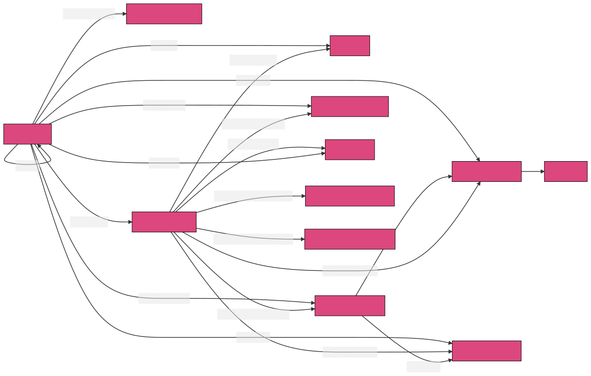

# RPC

This section is a work in progress.

The RPC subsystem is exclusicely in Server Agents. It is comprised of two main components:

1. the "RPC Server" (for lack of a better term) handles multiplexing of many different
   requests on a single TCP port.
2. RPC endpoints handle RPC requests and return responses.

The RPC subsystems handles requests from:

1. Client Agents in the local DC
2. (if the server is a leader) other Server Agents in the local DC
3. Server Agents in other Datacenters
4. in-process requests from other components running in the same process (ex: the HTTP API
   or DNS interface).

## Routing

The "RPC Server" accepts requests to the [server port] and routes the requests based on
configuration of the Server and the the first byte in the request. The diagram below shows
all the possible routing flows.

[server port]: https://www.consul.io/docs/agent/options#server_rpc_port

[source](./routing.mmd)

The main entrypoint to RPC routing is `handleConn` in [agent/consul/rpc.go].

[agent/consul/rpc.go]: https://github.com/hashicorp/consul/blob/main/agent/consul/rpc.go

## RPC Endpoints

This section is a work in progress, it will eventually cover topics like:

- net/rpc - (in the stdlib)
- new grpc endpoints
- [Streaming](./streaming)
- [agent/structs](https://github.com/hashicorp/consul/tree/main/agent/structs) - contains definitions of all the internal RPC protocol request and response structures.

## RPC connections and load balancing

This section is a work in progress, it will eventually cover topics like:

Routing RPC request to Consul servers and for connection pooling.

- [agent/router](https://github.com/hashicorp/consul/tree/main/agent/router)
- [agent/pool](https://github.com/hashicorp/consul/tree/main/agent/pool)

